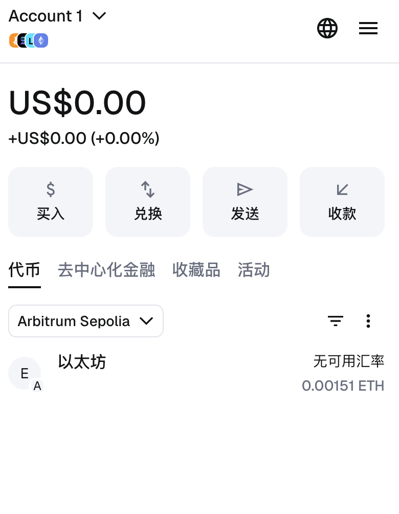
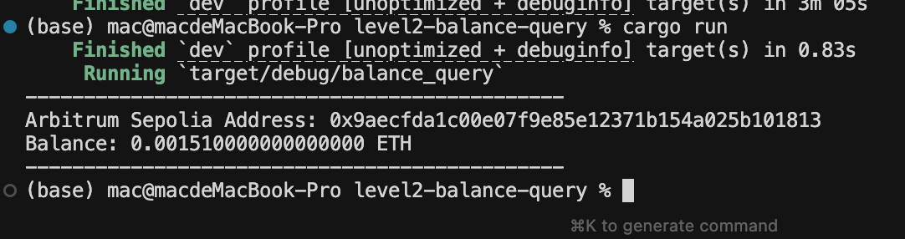
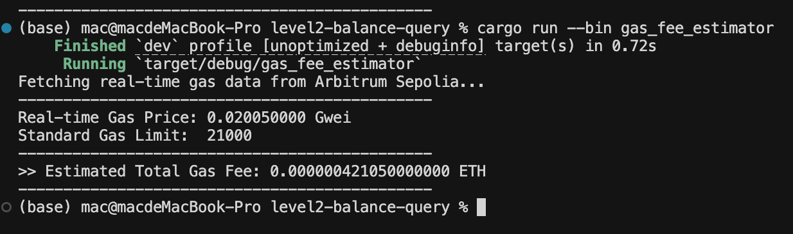
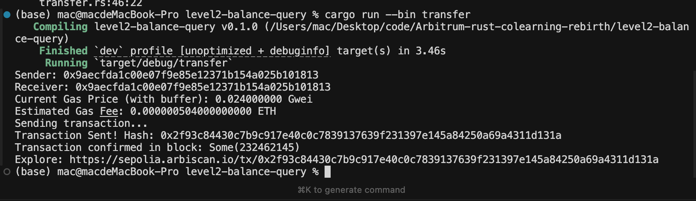
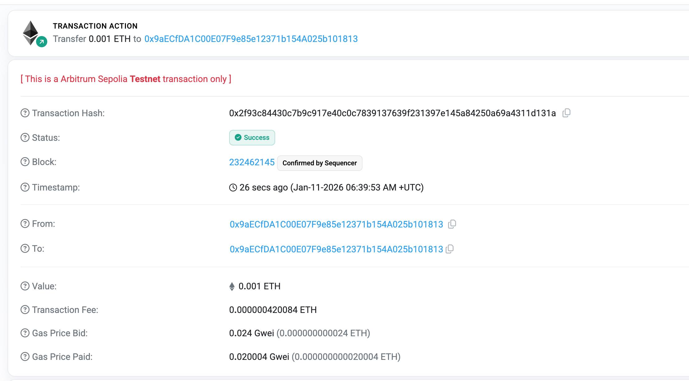
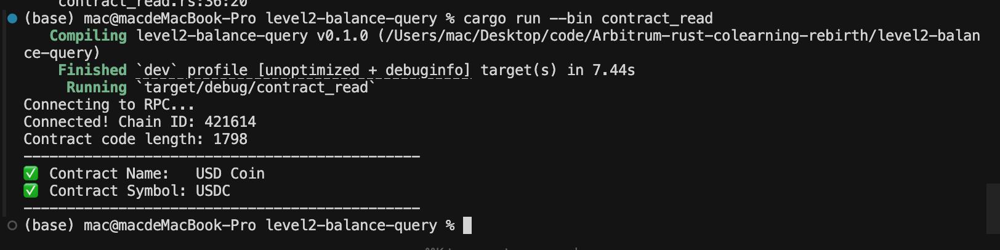

# Arbitrum-rust-colearning-rebirth
## 开发环境配置

### 1. 钱包配置
- **网络名称**: Arbitrum Sepolia
- **Chain ID**: 421614
- **状态**: 已成功连接并在 MetaMask 中切换至该网络。

 

### 2. 测试币领取
- **领取渠道**: Alchemy / Arbitrum Bridge
- **余额确认**: 账户已存入 0.1+ Sepolia ETH，用于部署合约及交互。
3.rust检查测试余额
/level2-balance-query/balance.rs
 

4.gas费预估
/level2-balance-query/gas-fee.rs
 

5.转账
/level2-balance-query/transfer.rs
 
 

6.合约
/level2-balance-query/contract_read.rs
